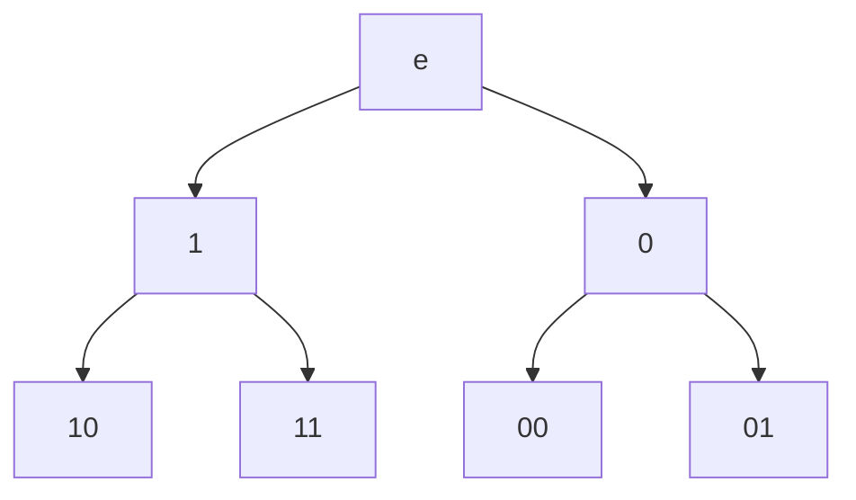

# Teoria kodowania:
- Kody kompresyjne
- Kody korekcyjne
- Kody kryptograficzne

$A = \{a_1,\dots, a_n\}$ - Alfabet
$a_1,\dots,a_n$ - $n$ liter

Słowem nazywamy ciąg liter:
$(a_{i_1},\dots,a_{i_k})$
Tradycyjnie zapisujemy słowa w postaci:
$a_{i_1}\dots a_{i_k}$, bez przecinków i nawiasów.

Długością słowa nazywamy ilość liter w nim występujących, długość słowa $v$ oznaczamy jako $|v|$.

Słowo puste oznaczamy symbolem $\epsilon,\quad |\epsilon| = 0$.

Przez $A^n$ oznaczamy zbiór słów długości $n$, przez $A^*$ oznaczamy zbiór wszystkich słów.

$$
A^0 = \{\epsilon\}
$$

## Twierdzenie:

Jeśli $A = \{a_1,\dots,a_n\}$ to $|A^k| = n^k$

## Alfabet binarny:

$\Upsigma = \{0, 1\}$ - alfabet binarny.
$\Upsigma^* = \{0, 1, 00, 01, 10, 11\dots\}$ - Zbiór wszystkich słów binarnych
$A^n$ - zbiór słów *n-bitowych*

## Grafy
Drzewo słów o długości mniejszej lub równej 2 dla alfabetu $\{0, 1\}$

