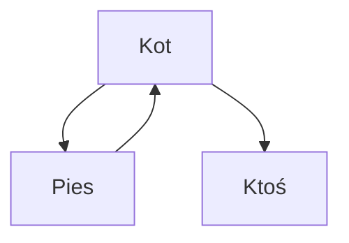

# jakiś test
- mamy listy
	- podlisty

```python
def func(that):
	return 1 if that else 2
```

row1 | row2
---|---
I am first | `i am second`

$$
2^2 - 3^3 = x\\
$$
$$
\begin{align*}
	2 - 2 &= 0 \\
	0 &= 0
\end{align*}
$$


[[testowe/inne]]

#CamelCase


