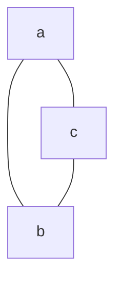
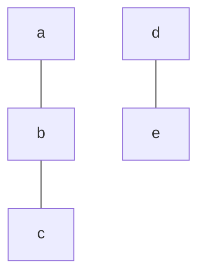

# Definicje
## Graf nieskierowany:
- Zbiór $V$ - zbiór elementów (wierzchołków)
	- $| V|$ - rząd grafu - ile jest wierzchołków
- Zbiór $E$ - Zbiór podzbiorów $V$ czyli zbiór krawędzi $E \subseteq \left\{\left\{ u, v \right\} : u, v \in V \right\}$
	- $|E|$ - rozmiar grafu - ile jest wierzchołków.
	- Jeżeli dla krawędzi $\{u, v\}$ zachodzi $u = v$ to mówimy o pętli (strzałka zaczyna się i kończy na tym samym wierzchołku).

## Graf skierowany:
krawędzie są jednokierunkowe.

## Graf etykietowany:
Jeżeli zamieszczamy na rysunku etykiety, to jest to graf etykietowany.

## Graf z krawędziami wielokrotnymi (multigraf)

Jeżeli elementy zbioru krawędzi się powtarzają (jest wiele strzałek z $a$ do $b$), to graf jest multigrafem.

## (multi)graf ważony:
Jeżeli każda krawędź ma jakąś przypisaną liczbę (wagę), to graf jest ważony.

## Graf prosty:
Graf nieskierowany bez pętli i krawędzi wielokrotnych:

## Szkielet grafu:
Szkieletem grafu *skierowanego* $A$ jest graf nieskierowany $B$ „bez strzałeczek".

Zawiera on wszystkie wierzchołki grafu $A$ oraz wszystkie połączenia grafu, ale bez strzałeczek i powtórzeń.

## Graf eulerowski
Graf eulerowski to graf, na którym można skonstruować cykl eulerowski, czyli taki który przechodzi przez każdą krawędź conajmniej raz.

## podgrafy:
Jeżeli każda krawędź oraz wierzchołek grafu $W_{arszawa}$ zawiera się w grafie $P_{olska}$, to $W$ jest podgrafem $P$. Oznaczamy to tak: $W < P$ 

Podgraf $H$ jest **Podgraf indukowany przez zbiór wierzchołków $W$** grafu $G$ wtedy, kiedy każdy podgraf $H$ zawiera tylko i wyłącznie wierzchołki $W$, $W = V(H)$, oraz zawiera wszystkie krawędzie łączące te wierzchołki w grafie $G$.

## Droga:
Drogą nazywamy ciąg postaci:
```
{
	węzeł0,
	krawędź węzeł0 -- węzeł1,
	węzeł1,
	krawędź węzeł1 -- węzeł2,
	…
	węzełn
}
```

- Jeżeli droga kończy się i zaczyna na tym samym węźle, to jest **cyklem**.
- Droga jest prosta, jeżeli żaden węzeł się nie powtarza.
- Graf jest **spójny**, jeżeli każdy z jego elementów jest połączony drogą. Maksymalny podgraf spójny grafu jest jego **składową spójności**.

Tutaj $\{a, b, c\}$ to składowa spójności niespójnego grafu.
- Długość drogi to *suma wag* krawędzi lub ich ilość, jeśli wag nie ma.
- Jeżeli nie ma krawędzi wielokrotnych (graf nie jest multigrafem) to można zapisywać tylko wierzchołki lub krawędzie.

## Wierzchołki:
### Stopień wierzchołka:
$deg(x)$ oznacza liczbę kresek wychodzących z danego wierzchołka:
- Jako iż pętla wychodzi dwa razy, to liczymy ją podwójnie.
- W grafie skierowanym wyróżniamy również:
	- stopień wychodzący - $out\, deg (x)$ - czyli ile kresek wychodzi.
	- stopień wchodzący - $in\, deg (x)$ - czyli ile kresek wchodzi.


# Izomorfizm:
Funkcja $f: V(G) \rightarrow V(H)$ nazywamy **izomorfizmem grafów** G, H wtedy i tylko wtedy, gdy:
- jest bijekcją.
	- AKA każdy argument dostaje unikalny wynik
- zachowuje sąsiedztwo wierzchołków. (nie usuwa krawędzi)
- Jeżeli są wagi, to je zostawiamy w spokoju.
- Jeżeli $G, H$ są multigrafami to nie zmieniamy liczby wierzchołków.

Multigrafy są izomorficzne $G \cong H$ jeżeli istnieje izomorfizm G na H.

## Niezmieniki izomorfizmów:
- rząd
- rozmiar
- liczba wierzchołków danego stopnia
- liczba składowych spójności
- liczba pętli i krawędzi wielokrotnych
- liczba cykli n-tej długości.
- liczba dróg prostych.

# Przykłady grafów prostych:
- n-**wierzchołkowy** - $N_n$, zawiera n wierzchołków
- **Pusty** graf bez krawędzi.
- **Pełny** - $K_n$, wszystkie krawędzie.
- r-**regularny** - każdy wierzchołek ma stopień równy $r$
	- Graf 2-regularny n-wierzchołkowy nazywamy cyklem, oznaczamy $C_n$. Jest kółkiem.
- Las - graf bez cykli.
	- Drzewo - las spójny
	- Łańcuch - cykl ale ktoś zajebał jedną krawędź.
- Graf dwudzielny:
	- niech istnieją grafy $V_1, V_2$, które są grafami bez żadnych krawędzi.
	- Jeśli każdy wierzchołek z $V_1$ jest sąsiedni z każdym innym wierzchołkiem z $V_2$, to jest to graf **pełny dwudzielny**.

# Minimalne drzewo rozpinające
Podgraf grafu nieskierowanego, który sam jest drzewem, jest jego minimalnym drzewem rozpinającym.
Jeżeli mamy do czynienia z grafem ważonym, to suma wag musi być jak najniższa.

