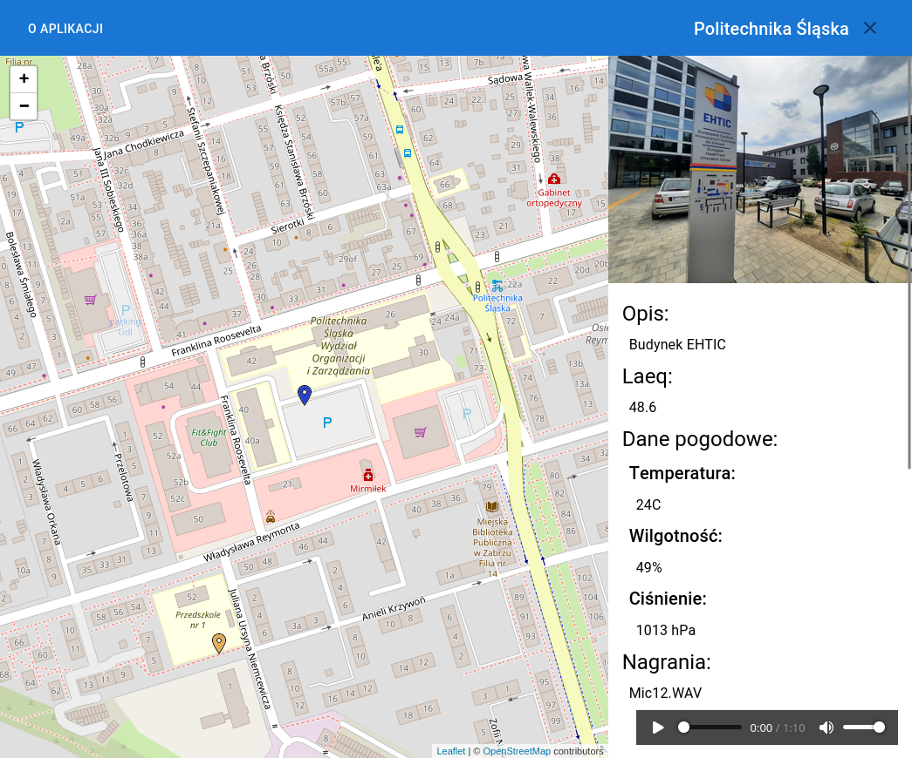
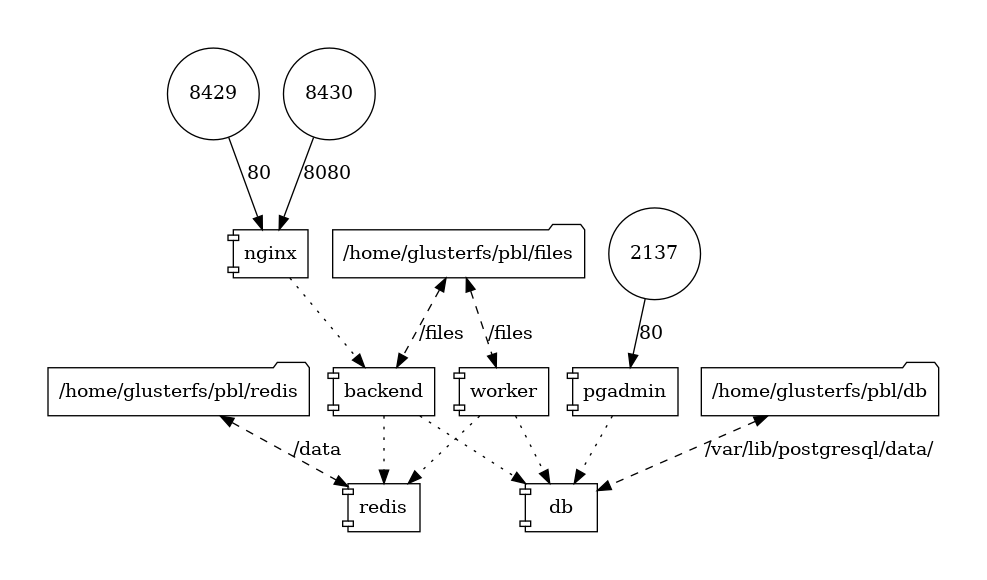
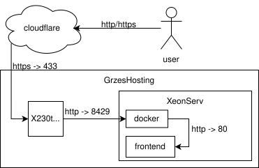
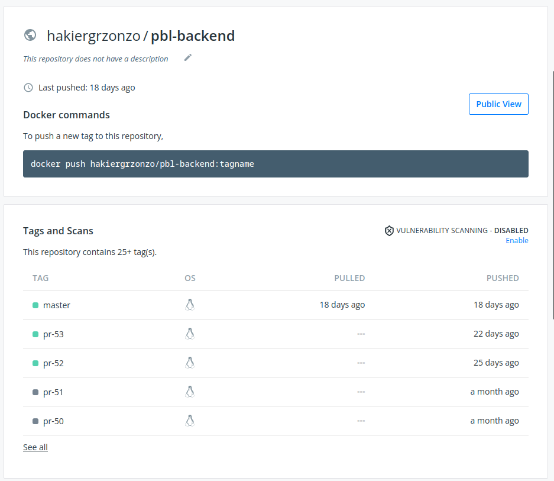
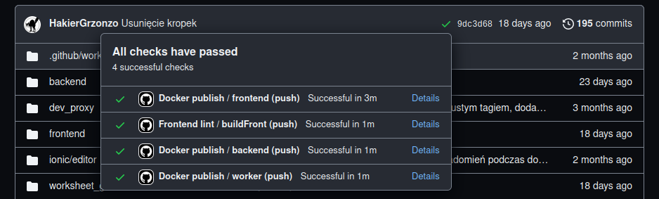

# Czym jest PBL?
Na politechnice istnieje coś takiego jak `Project Based Learning`, na które zostaliśmy zwerbowani przez dr. Marcina Sobotę.

- Zamiast chodzić na część przedmiotów (do 50% ECTS), prowadzimy działania w ramach projektu.
- W ramach projektu prowadzimy badania, które zostaną udokumentowane publikacją naukową.

## O czym jest nasz projekt PBL?

**Sposób badania krajobrazu dźwiękowego przestrzeni miejskich: studium przypadku**

::: columns
:::: column

Naszym zadaniem podczas projektu było przygotowanie platformy do przechowywania pomiarów dźwięku (jako dane z miernika i pliki audio) i prezentacja ich w formie mapy.

Dokonaliśmy tego tworząc aplikację webową w stosie technologicznym. `react/fastapi/dramatiq/postgresql/redis`

::::

:::: column

{height=200px}

::::

:::

# Opis Aplikacji

## Jakie mieliśmy ograniczenia?

- Bardzo niski budżet na zaplecze techniczne projektu: 0zł
	- Budżet projektu został przeznaczony na sprzęt do badań.
- Nie możność skorzystania z jakiejś chmury, więc hostujemy aplikację sami.
	- Przydatne rady dla was jak chcecie sobie coś w akademiku postawić.

## GrzesHosting, czyli nasza infrastruktura

Co mamy: 

::: columns
:::: column

- Typowe domowe światłowodowe połączenie intenetowe
	- `300/30`
	- Zewnętrzne ip, ale bez portu 80
- Serwer *dell poweredge r720*
	- Host serwisów dockera
- Dwóch programistów gotowych w ramach ,,to do nauki\'\' wykorzystać każdy darmowy `tier`

::::
:::: column

::::
:::

## Organizacja projektu oparta o mikroserwisy dockerowe:

Jako iż oboje posiadamy duże doświadczenie z dockerem, postanowiliśmy aplikacją podzielić na serwisy odpowiedzialne za różne zadania.

- `nginx` - hostowanie strony frontendowej oraz stron administracyjnych, reverse proxy do `backendu`
- `backend` - CRUD pomiarów, autoryzacja użytkowników
- `worker` - Asynchroniczna kompresja plików, parsowanie danych `EXIF` oraz pogodowych

Terminacja SSL jest rozwiązana za pomocą `nginx` uruchomionego jako serwis, gdyż zajmuje się on również innymi serwisami `GrzesHosting`.

## Schemat infrastruktury
{height=5.5cm}

## Cloudflare

::: columns

:::: column

Firma Cloudflare oferuje darmową usługę `proxy https`. Pozwala to na odciążenie naszej infrastruktury poprzez cache poza naszym konsumenckim połączeniem internetowym.

Niestety darmowy plan ma ograniczenie 100mb dla wysyłanych plików, więc musieliśmy to wziąć pod uwagę podczas pomiarów.

::::

:::: column

{height=5.5cm}

::::

:::
# CI/CD

## Problemy wynikające z użycia dockera

- Buildy są trudne.
	- Domyślnie kontenery są przechowywane tylko na naszym komputerze.
	- Manualne wysyłanie kontenerów do repozytorium jest trudne, tagi nie są informacyjne itp.
	- Windows zawsze znajdzie jakiś sposób, by wywalić builda.
- Deploy jest trudny.
	- Konieczność zabaw z gitem na serwerze
	- Zarządzanie ustawieniami na produkcji wpływa na środowiska testowe.

## Github actions 

::: columns
:::: column
W celu rozwiązania problemów z buildami wprowadziliśmy automatyczne budowanie oraz wysyłanie kontenerów do repozytorium `dockerhub` przy pushach do repozytorium.

Dla każdej PR publikowane są kontenery odpowiednio tagowane oraz dostępne są zawsze aktualne kontenery `master`, oraz dla stabilnych wersji z githuba.
::::
:::: column

::::
:::

## Jak to wygląda?

::: columns
:::: column
{height=5.8cm}

::::
:::: column

Zadania dla `github actions` definiujemy w plikach `yaml` w repozytorium w specjalnym folderze `.github`.

Tutaj:

- Pobieramy repozytorium
- określamy jaki tag będziemy budować
- logujemy się do platformy `docker hub` za pomocą sekretów 
- budujemy i wysyłamy obraz kontenera z odpowiednimi tagami.

::::
:::

## Jak to wygląda 2

## Co więcej można z tym zrobić?

Rozwiązanie `Continous Integration` pozwalają nam na wiele więcej niż samo budowanie aplikacji:

- Uruchamianie testów i zwracanie informacji czy jakieś przestały działać.
- Sprawdzanie, czy kod spełnia standardy i czy nie ma w nim ostrzeżeń od kompilatora lub innego narzędzia lintującego.
- Automatyczne stawianie programu ze zmianami, by ułatwić kontrolę jakości.
- Automatyczne wysyłanie nowej wersji do *produkcji* (CD) i tworzenie kopii zapasowych baz danych.

## Czemu nie mamy CD?

> Everybody has a testing environment. Some people are lucky eneugh to have a totally separate environment to run production in.
> 
> — @stahnma

Nie mamy automatycznego wysyłania nowych wersji po pushu, ponieważ zwykle sami sprawdzamy wersje z `PR` na produkcji.

Przy zaledwie dwóch programistach, podejście na zasadzie ,,nasze CD to napisanie do kogoś by zrobił deploy\'\' było wystarczające.

## Q&A
- Kod jest dostępny na githubie: https://github.com/HakierGrzonzo/PBL-polsl-2022
- Strona jest dostępna pod adresem: https://pbl.grzegorzkoperwas.site/