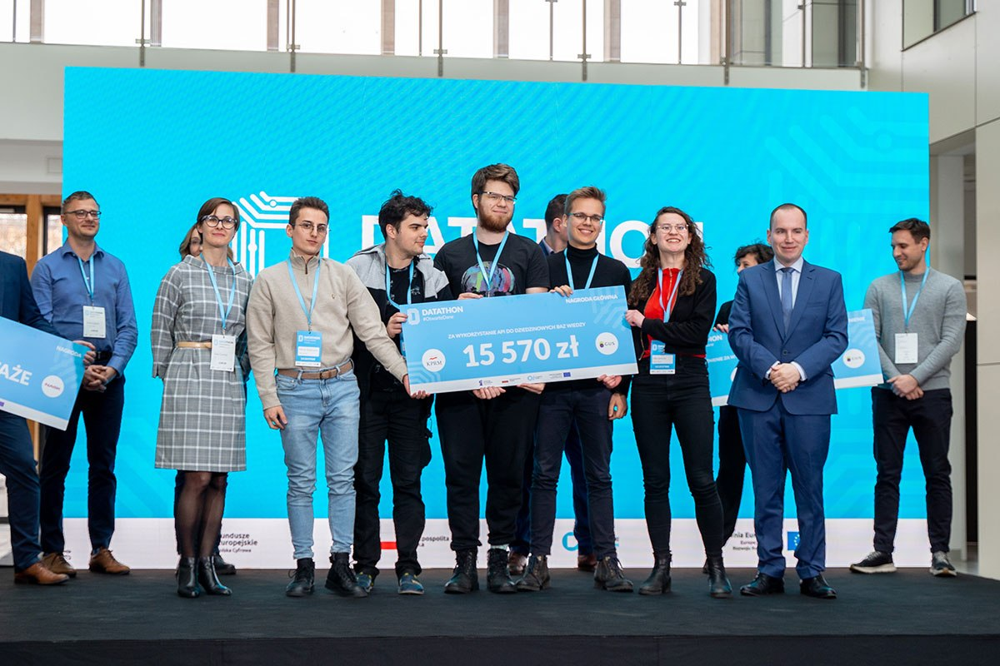

# ,,Gdzie'' 
**,,Gdzie''** - Aplikacja stworzona podczas hackathonu *Datathon* zorganizowanego przez *Kancelarię Prezesa Rady Ministrów* 2-3 kwietnia w Warszawie.

Jej zadaniem jest kierowanie uchodźców do miejsca, w którym otrzymają oni pomoc.

# Skład zespołu

::: columns

:::: column

- Politechnika Śląska:
	- Grzegorz Koperwas
	- Kamil Kowalczyk
- Politechnika Warszawska:
	- Ola Jamróz
	- Kuba Forczek
	- Patryk Będkowski

:::: 

:::: column

{width=250px}

::::

::: 

# Skąd wziął się pomysł?
- Brak inicjatyw ogólnokrajowych:
	- Większość przedsięwzięć jest organizowana przez lokalne samorządy.
	- Nawet rozwiązania centralne wymagają kontaktu z lokalnymi urzędami lub szkołami.
- Większość uchodźców kieruje się do największych miast takich jak *Warszawa* i *Kraków.*

# Rozwój pomysłu

Zadaniem konkursowym było wykorzystanie rządowych danych w celu pomocy uchodźcom z Ukrainy.

## **Research** jako często pomijana rzecz na hackathonie:
Na przeszukiwanie rządowych danych przeznaczyliśmy **co najmniej 6 godzin** z 24 które trwał konkurs.

{width=180px}

# Stos technologiczny na hackathon

Wybraliśmy `react/nginx/fastapi/postgres` ponieważ robimy w tym stosie inne projekty.

## Rady

- Używaj tego, w czym wymiatasz.
- Używaj tego, gdzie możesz wklejać rzeczy z innych swoich projektów.
- To nie musi być perfekcyjne, to ma pokazać sens rozwiązania.
- Nie wygrasz hackathonu `kubernetes`em

# Prezentacja aplikacji
{width=300px}

# Pytania i odpowiedzi

{width=300px}

