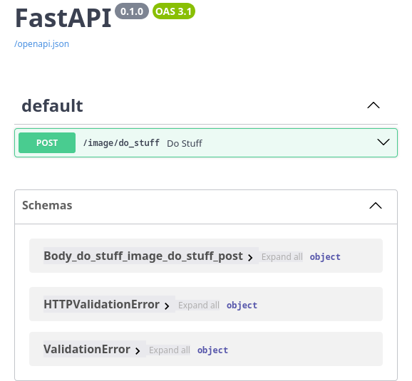

# Cel projektu

::: { .columns align=center }

:::: { .column width=60% } 

Celem projektu jest zabezpieczenie prostej aplikacji wykonanej w środowisku
`FastAPI`, wykorzystującej model `LLava`.

::::

:::: { .column width=40% } 

::::

:::

# Założenia projektowe

## Czym będziemy się zajmować?

W aplikacji będziemy zajmować się następującymi problemami, związanymi z
`API4:2023 Unrestricted Resource Consumption`:
\pause

- Podczas przetwarzania więcej niż dwóch zapytań aplikacja się zacina.
\pause
- Aplikacja może zjeść całą pamięć RAM

## Czym nie będziemy się zajmować?

- Długość promptu - Model `LLava` nie przejmuje się promptem zbytnio, aplikacja
  była używana tylko jako wewnętrzne API ze stałym promptem.
\pause\medskip
- Rozmiar załączników - Framework `FastAPI` nie ma dobrego mechanizmu na
  ich ograniczenie, więc tutaj najlepszym sposobem byłoby robienie tego za
  pomocą serwera proxy.

# Live Demo

::: { .columns align=center }

:::: { .column width=14% } 

Live Demo

::::

:::

# Podsumowanie

- Ograniczenie maksymalnej ilości instancji modelu
gwarantuje nam pewien maksymalny poziom zużycia pamięci
- Podczas używania rozwiązań opartych o LLM musimy
zdawać sobie sprawę, że czas oczekiwania na odpowiedź od takiego modelu może
być długi
