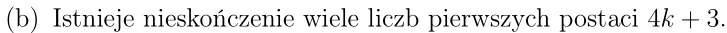

# system punktowy

100 max

20 za ćwiczenia + zadania domowe.

Na platformie ważne informacje.

Po rozwiązaniu zadania przy tablicy mail wysłać, samodzielne zgłoszenie daje plusy.

-----------

> !!!
>  
> Udowodnić na 27.10.2020

# Wzory z urojonych:
$$
\left| z \right| \left(\cos \alpha + i \sin \alpha \right) = \left|z\right| e^{i\alpha} \\
	\left| z \right| = \sqrt{a^2 + b^2}\\
	\left\{\begin{matrix}
		\cos \alpha = \frac{a}{\left| z \right|} \\
		\sin \alpha = \frac{b}{\left| z \right|}
	\end{matrix}\right.
$$
$$
\left| z \right| \left(\cos \alpha + i \sin \alpha \right) \cdot \left| w \right| \left(\cos \beta + i \sin \beta \right) = \left| z w \right| \left(\cos \left(\alpha + \beta\right) + i \sin \left(\alpha + \beta\right)\right)
$$

$$
\frac{\left| z \right| \left(\cos \alpha + i \sin \alpha\right)}
{\left| w \right| \left(\cos \beta + i \sin \beta \right)} = \left|\frac{z}{w}\right| \left(\cos \left(\alpha - \beta\right) + i \sin \left(\alpha - \beta\right)\right)
$$
$$
\left(\left| z \right| \left(\cos \alpha + i \sin \alpha \right) \right)^n = \left| z^n \right| \left(\cos \left(\alpha \cdot n\right) + i \sin \left(\alpha \cdot n\right)\right)
$$
