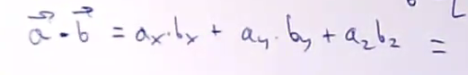
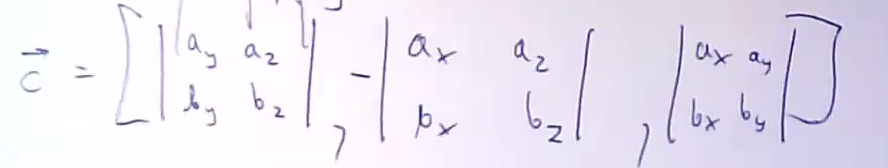

# Wektory

## Iloczyn skalarny

$$
\vec{a} \cdot{} \vec{b} = a_xb_x + a_yb_y + a_z c_z \\
\text{lub:}\\
\vec{a} \cdot{} \vec{b} = a \cdot{} b \cdot{} \cos \alpha
$$
daje liczbę, nie wektor

np:
$$
\vec{F}\cdot{}\vec{\Delta r} = \Delta W
$$

## Iloczyn wektorowy

Nieprzemienny!
$$
\vec{c} = \vec{a} \times \vec{b} = - \left( \vec{b} \times \vec{a}\right)
$$

$$
c = ab\sin\alpha
$$

Reguła śruby prawoskrętnej:

> przekręcić pierwszy wektor do drugiego, sprawdzić czy wkręcamy

$$
\vec{a} \times \vec{b} = \vec{c}\\

\vec{c} = \left[
	\begin{vmatrix}
		a_y & a_z \\
		b_y & b_z
    \end{vmatrix}, 
	\begin{vmatrix}
		a_x & a_z \\
		b_x & b_z 
	\end{vmatrix},
	\begin{vmatrix}
		a_x & a_y \\
		b_x & b_y 
	\end{vmatrix}
\right]
$$

